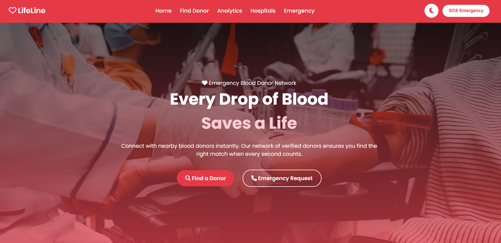
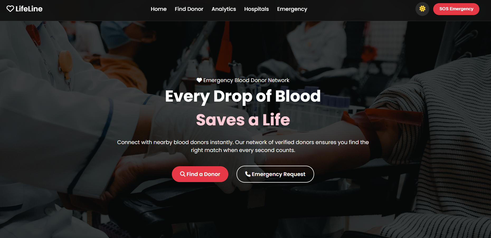
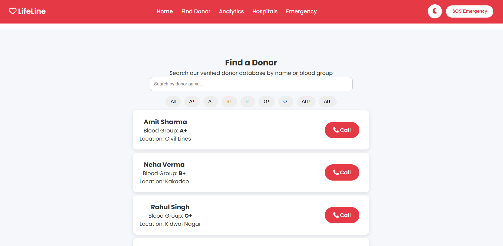
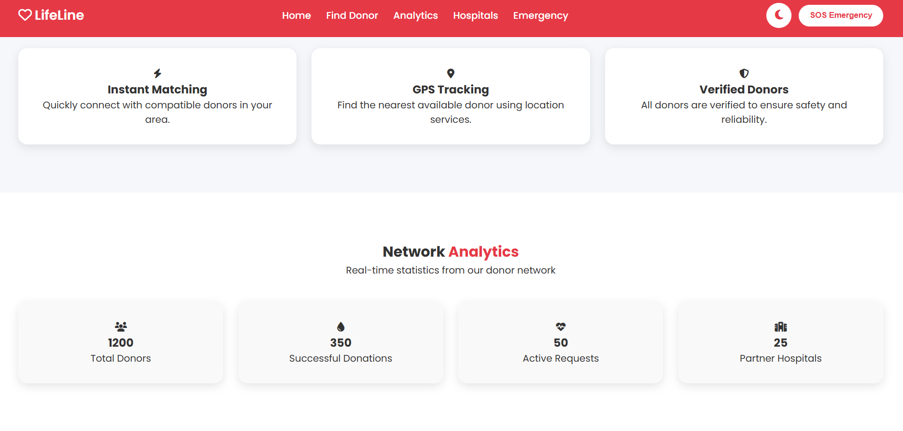
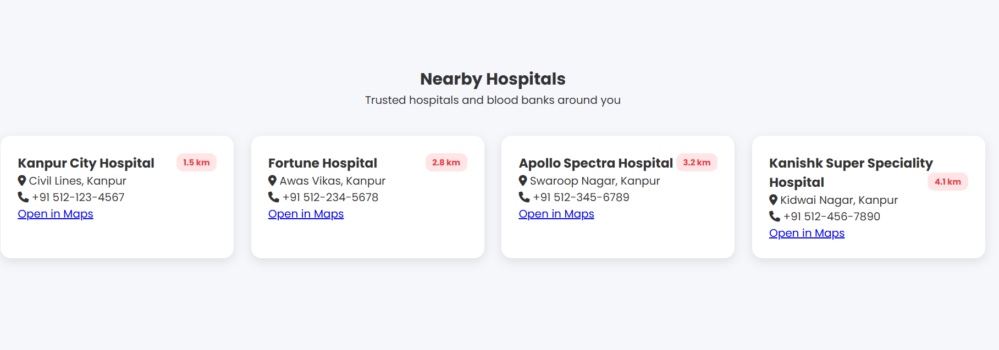
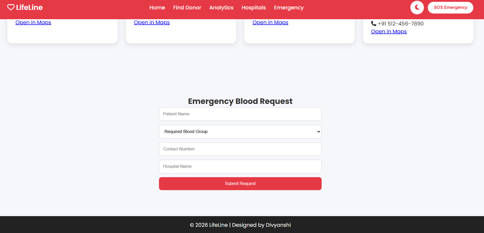

# ❤️ LifeLine – Blood Donor Network

A modern and responsive blood donation web application that helps users quickly find nearby blood donors, view hospitals, and submit emergency blood requests. Built with HTML, CSS, and JavaScript to provide a simple and user-friendly experience during emergencies.

---

## ✨ Features

- 🔍 Search donors by name
- 🩸 Filter donors by blood group
- 🏥 View nearby hospitals with Google Maps integration
- 🚨 Submit emergency blood requests
- 📊 Animated analytics dashboard
- 🌙 Light/Dark Mode with theme persistence
- 📱 Fully responsive design

---

## 🛠️ Tech Stack

- HTML5
- CSS3
- JavaScript (ES6)
- Font Awesome
- Google Fonts (Poppins)

---

## 🌐 Live Demo

🔗 **Coming Soon...**

> *(Replace this with your GitHub Pages or Vercel link after deployment.)*

---

## 📸 Project Screenshots

### 🏠 Home Page



### 🌙 Dark Mode


---

### 🔍 Find Donor



---

### 📊 Analytics Dashboard



---

### 🏥 Nearby Hospitals



---

### 🚨 Emergency Blood Request



---

## 📂 Project Structure

```text
LifeLine/
│── index.html
│── style.css
│── script.js
│── README.md
└── images/
    ├── home.png
    ├── donor-search.png
    ├── analytics.png
    ├── hospitals.png
    └── emergency.png
```

---

## 🚀 Getting Started

1. Clone the repository

```bash
git clone https://github.com/divyanshiverma87/LifeLine-Blood-Donor-Network.git
```

2. Open the project folder.

3. Open **index.html** in your browser.

No additional installation is required.

---

## 🔮 Future Enhancements

- User authentication
- Real-time donor database
- GPS-based nearby donor search
- Email/SMS notifications
- Admin dashboard
- Blood donation history

---

## 👩‍💻 Author

**Divyanshi Verma**

- GitHub: https://github.com/divyanshiverma87
- LinkedIn: https://www.linkedin.com/in/divyanshi-verma-247851332/

---

## ⭐ If you like this project

Give this repository a ⭐ on GitHub.